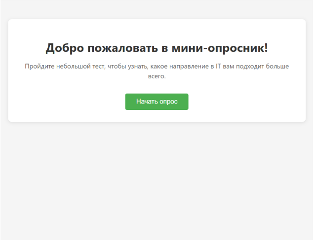
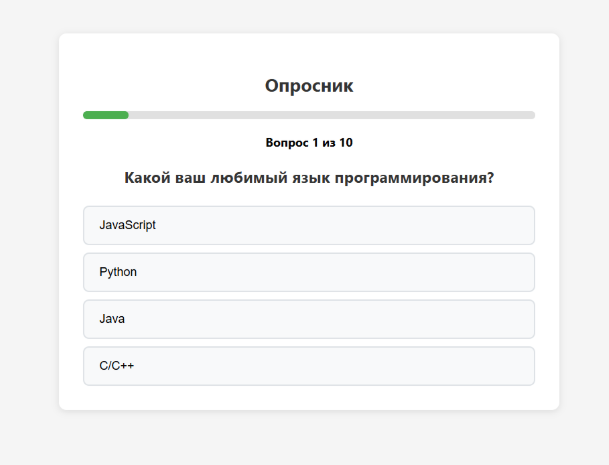
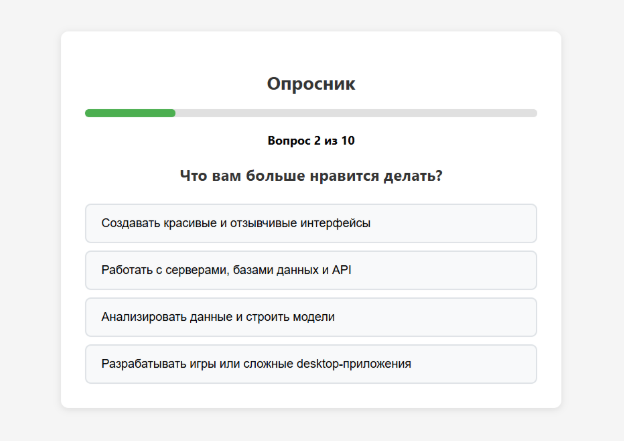
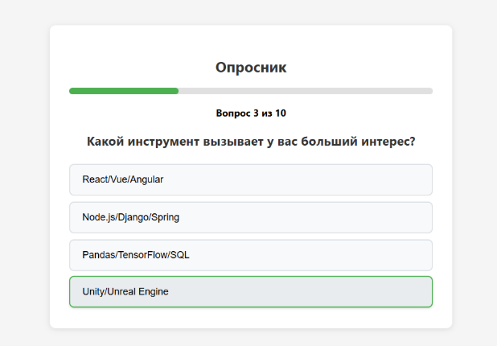
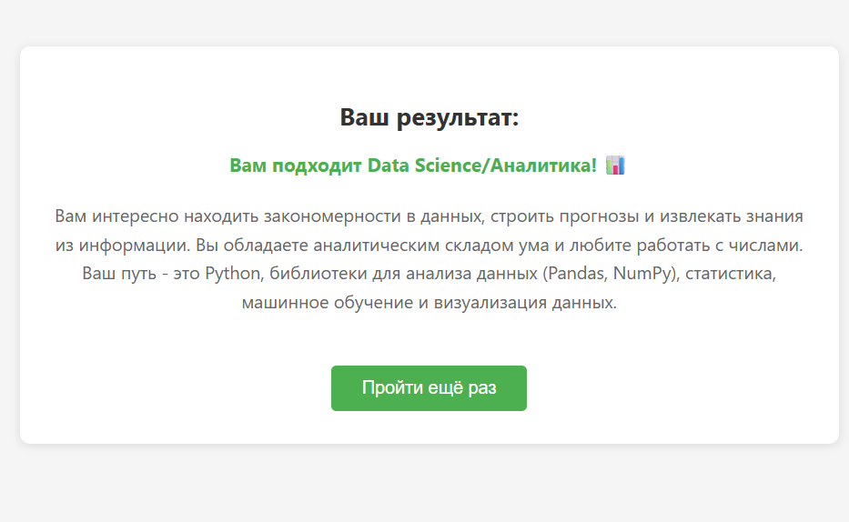

# Мини-опросник на React

Небольшое React-приложение - интерактивный опросник, который помогает определить подходящее направление в IT на основе ответов пользователя.

## 🚀 Основные возможности

- **Стартовая страница** с приветствием и описанием опросника
- **Пошаговый опросник** из 10 вопросов с индикатором прогресса
- **Визуальный прогресс-бар** для отображения текущего положения в опросе
- **Интуитивный интерфейс** с красивыми кнопками ответов
- **Автоматический расчет результата** на основе выбранных ответов
- **Персонализированные результаты** с подробным описанием
- **Возможность пройти тест заново**

## 🛠 Технологии

- **React 18** (функциональные компоненты, хуки)
- **React Router DOM** (для навигации между страницами)
- **React Hooks** (useState, useNavigate, useSearchParams)
- **CSS3** (кастомные стили, flexbox, анимации)
- **JavaScript ES6+**

